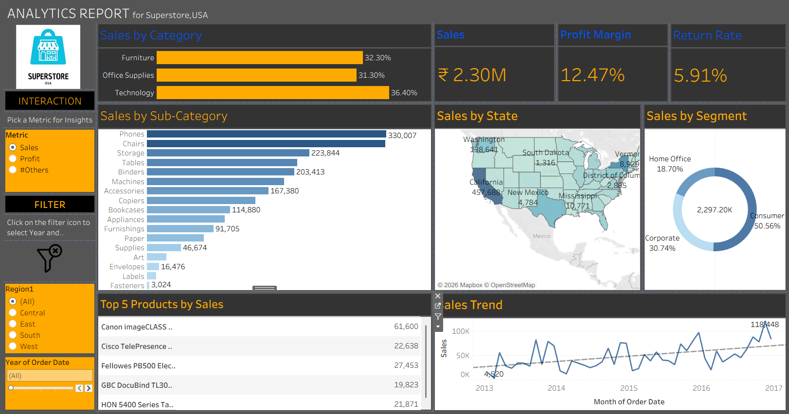

# Customer & Sales Analysis Dashboard

## Project Overview

This project is an interactive Tableau dashboard created to analyze customer and sales performance.

The dashboard provides insights into sales trends, customer behavior, product performance, and overall business performance.

## Tools Used

- Tableau
- Excel

## Key Analysis

- Total Sales
- Total Profit
- Customer Analysis
- Sales by Category
- Sales by Region
- Product Performance
- Sales Trends
- Profitability Analysis

## Key Insights

- Total sales reached approximately ₹2.30M.
- Profit margin was approximately 12.47%.
- Return rate was approximately 5.91%.
- Technology, Office Supplies, and Furniture were analyzed by category.
- Sales performance was compared across different U.S. states and customer segments.
- Top-performing products were identified based on sales.
- Sales trends were analyzed over time.

## Dashboard

The dashboard allows users to interact with the data using filters and visualizations to identify important sales and customer trends.

## Dashboard Preview

## Project File

The Tableau packaged workbook (`.twbx`) is included in this repository.

To view the dashboard, download the `.twbx` file and open it using Tableau Desktop.

## Author

Riyaas Deen
